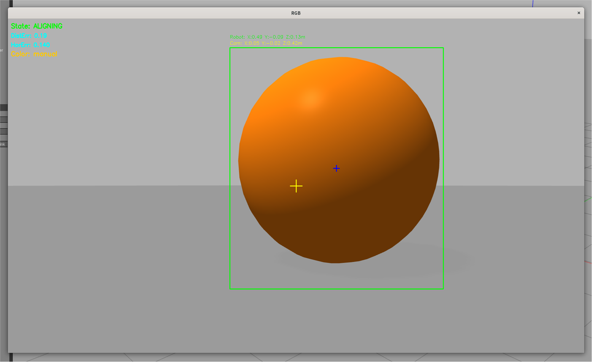
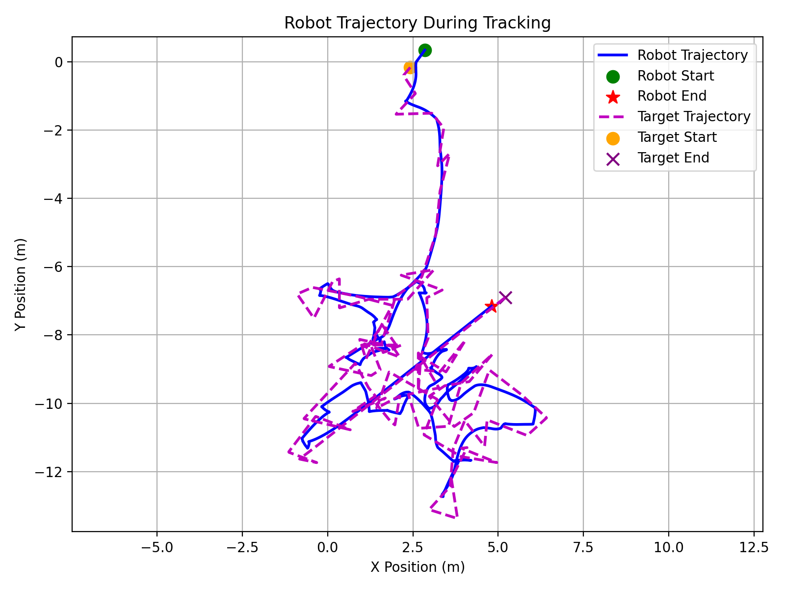

**Read this in other languages: [English](README_en.md), [中文](README.md), [Français](README_fr.md), [Español](README_es.md), [العربية](README_ar.md), [Русский](README_ru.md), [日本语](README_jp.md)**
# 🎯 ROS ベースの TurtleBot3 色対象追跡・制御システム 🤖


## 📋 プロジェクト概要

本プロジェクトは、RGB-D カメラを用いて色付き対象物体をリアルタイムで検出・追跡・追従する、完全な ROS 自律移動ロボットシステムを実装します 🎨

HSV 色空間による対象セグメンテーション、奥行き情報を活用した対象の 3D 位置推定、そして有限状態マシンによる頑健な追跡制御動作を実現します 🎯


## ✨ 機能特徴

| 機能 | 説明 |
|:---|:---|
| 🎨 **色対象検出** | HSV 色空間に基づく頑健な対象セグメンテーション |
| 📍 **3D 位置推定** | RGB-D 奥行き情報を用いてカメラ座標系およびロボット座標系での対象位置を計算 |
| 🔄 **ステートマシン制御** | `SEARCHING` → `ALIGNING` → `APPROACHING` → `REACHED` の 4 状態追跡戦略 |
| 🏃 **動的対象追跡** | 移動対象のリアルタイム追従をサポート |
| 🌈 **複数色対応** | 緑 💚 / 橙 🧡 / 赤 ❤️ / 青 💙 から選択可能（OpenCV スライダーで切替） |
| 📡 **LiDAR フォールバック**（ベータ版） | 深度が無効な場合に LiDAR で距離測定を代替 |


## 📁 ファイル説明

| ファイル | 説明 | バージョン |
|:---|:---|:---:|
| `hsv_node_release.py` | ⭐ **正式版追跡プログラム** | ✅ |
| `hsv_node_beta.py` | 🧪 LiDAR フォールバック機能付きベータ版 | 🔬 |
| `turtlebot3_balls.launch` | 🌍 Gazebo シミュレーション起動ファイル（カラーボール生成） | - |
| `move_ball.py` | ⚽ 対象ボールをランダム移動させるプログラム | - |
| `plot_trajectory.py` | 📈 ロボットの軌跡を記録・プロットするプログラム | - |
| `tracking_metrics.py` | 📊 パフォーマンス指標評価プログラム | - |


## 🛠️ システム要件

- 🐢 ROS Noetic
- 🤖 TurtleBot3
- 📷 OpenCV
- 🐍 Python 3


## ⚙️ インストールとビルド

```bash
# ワークスペースに移動
cd ~/catkin_ws/src

# リポジトリをクローン
git clone https://github.com/your_username/image_pkg.git

# ビルド
cd ~/catkin_ws
catkin_make

# 環境設定
source devel/setup.bash
```


## 🚀 クイックスタート

### 1️⃣ シミュレーション環境の起動

```bash
export TURTLEBOT3_MODEL=waffle
roslaunch image_pkg turtlebot3_balls.launch
```

### 2️⃣ 対象追跡の開始

**正式版** ⭐（レポートはこの版に基づく）：
```bash
rosrun image_pkg hsv_node_release.py
```

**ベータ版** 🧪（LiDAR フォールバック付き）：
```bash
rosrun image_pkg hsv_node_beta.py
```

### 3️⃣ 対象ボールを移動させる（オプション）⚽

```bash
rosrun image_pkg move_ball.py _model_name:=green_ball
```

### 4️⃣ ロボットの軌跡を記録 📈

```bash
rosrun image_pkg plot_trajectory.py \
    _output_path:=~/trajectory.png \
    _target_model_name:=green_ball
```

### 5️⃣ パフォーマンス評価 📊

```bash
rosrun image_pkg tracking_metrics.py \
    _target_color_name:=green \
    _auto_stop_on_reached:=true
```


## 🎮 操作説明

`hsv_node_release.py` 起動後、OpenCV ウィンドウが表示されます：

| ウィンドウ | 機能 |
|:---|:---|
| 🎚️ **Threshold** | スライダーで対象色を選択（`0`=手動, `1`=💚緑, `2`=🧡橙, `3`=❤️赤, `4`=💙青） |
| 🖼️ **RGB** | 検出結果を表示（緑枠 ✅、青十字中心 🔵、ステータス情報） |
| 📊 **Result** | HSV 閾値処理後の二値画像を表示 |

ロボットは自動的に以下の状態サイクルに入ります：

```
🔍 SEARCHING ──► 🎯 ALIGNING ──► 🏃 APPROACHING ──► ✅ REACHED
```


## 📷 ビジュアル効果

### 対象検出効果


### ロボット追跡軌跡



## 📚 参考文献

- 📖 [ROS Wiki](http://wiki.ros.org/)
- 📖 [OpenCV Documentation](https://docs.opencv.org/)
- 📖 [wpr_simulation](https://github.com/6-robot/wpr_simulation.git)
